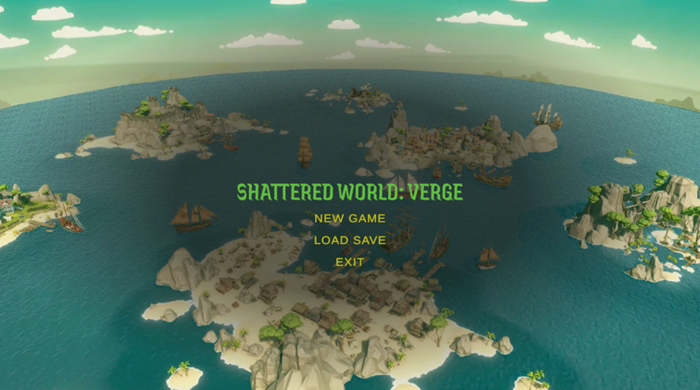
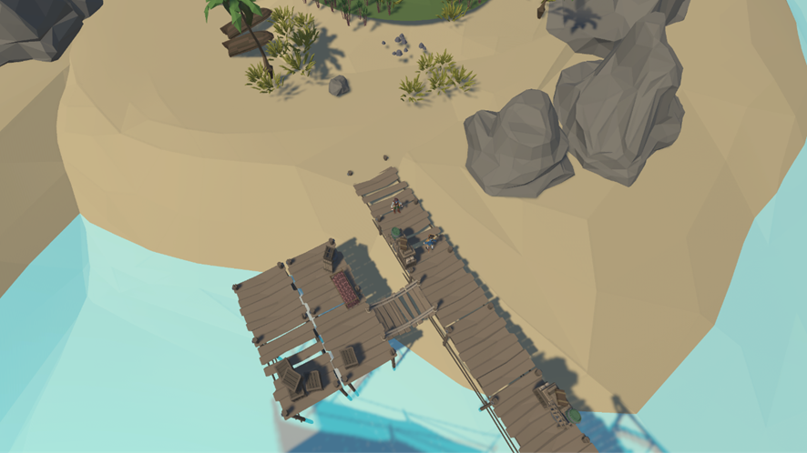
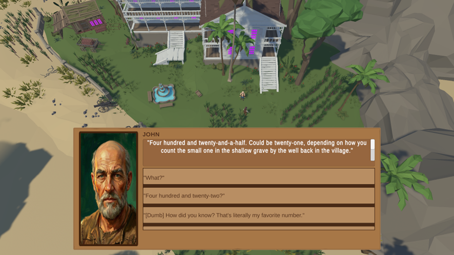
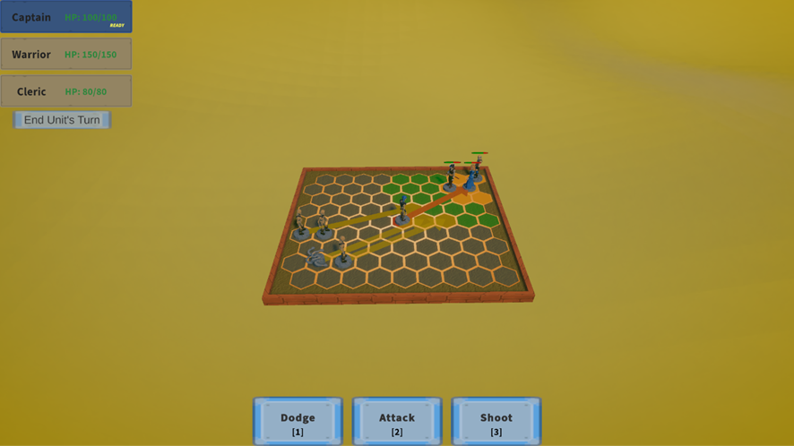

# Shattered Worlds: Verge

GitHub repository: https://github.com/The-ScrumCycle/CRPGProject

Shattered Worlds: Verge is a Unity/C# isometric CRPG developed by an 8-person team.  
The game combines multi-island exploration, ship travel, NPC dialogue, companions, enemy encounters, save/load progression, and tactical turn-based combat.

## Preview

## Game Features

### Multi-Island Exploration

The game features a pirate-inspired open world made of multiple islands.  
Players can explore different areas, interact with NPCs, encounter enemies, and travel between islands by ship.

### Dialogue and Story Progression

The game includes NPC dialogue, companion conversations, story progression, and interactions connected to quests and encounters.

### Tactical Turn-Based Combat

Combat includes multiple enemies, multiple companions, movement, attacks, enemy behavior, and different combat scenarios connected to exploration encounters.

### Additional Features

- Click-to-move exploration
- Ship travel between islands
- Companion characters
- Enemy encounters across the world
- Monster AI and enemy behavior
- Final boss encounter with Malakor
- Save/load system using JSON save data
- Game over screen with load-save functionality
- Scene transitions between exploration, combat, death, and game over

## Team Members

- Carlos Alvarado: Team lead and world/exploration lead
- Debojyoti Biswas: World building and island development
- Howe Wu: UI and screen mockups
- Patrick William: Dialogue system and save system
- Alexandre Lamarche: Database/schema planning and save data structure
- Raphael Dapalma: Combat lead and core gameplay state management
- Jonah Wood: Save/load system and combat presentation improvements

## Project Structure

The project is organized around the main gameplay systems:

- Exploration and island navigation
- Dialogue and NPC interactions
- Tactical combat encounters
- Save/load and game state management
- UI screens and menus
- Scene transitions between exploration, combat, and game over states
